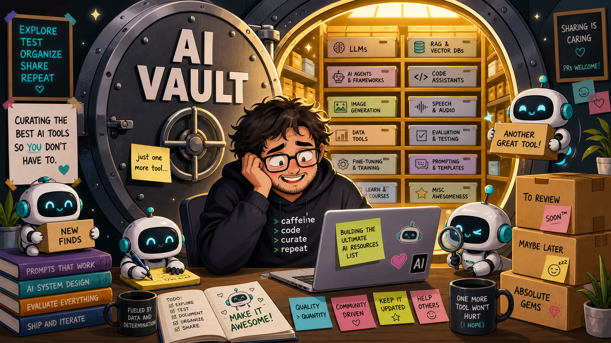

# AI Vault

My curated vault of resources for learning, building, shipping, and using AI in software development. The focus is practical AI engineering: LLM applications, agentic coding, RAG, local models, evaluation, observability, ML foundations, and durable learning material.

This list is intentionally selective. It favors resources that help developers understand AI systems or build with them, and leaves out entries that are mainly unrelated productivity, marketing, sales, entertainment, or generic software material.

## Contents

- [Start Here](#start-here)
- [AI Coding Assistants](#ai-coding-assistants)
- [Software Engineering Agents](#software-engineering-agents)
- [Agent Frameworks](#agent-frameworks)
- [LLM App Frameworks](#llm-app-frameworks)
- [RAG, Search, and Knowledge](#rag-search-and-knowledge)
- [Vector Databases](#vector-databases)
- [Local LLMs and Inference](#local-llms-and-inference)
- [Model Providers and Families](#model-providers-and-families)
- [Evals, Observability, and LLMOps](#evals-observability-and-llmops)
- [Prompting and Playgrounds](#prompting-and-playgrounds)
- [Machine Learning and Deep Learning](#machine-learning-and-deep-learning)
- [Multimodal AI](#multimodal-ai)
- [Datasets and Benchmarks](#datasets-and-benchmarks)
- [Courses and Books](#courses-and-books)
- [Papers and Research Context](#papers-and-research-context)
- [Communities, News, and Related Lists](#communities-news-and-related-lists)

## Start Here

- [OpenAI Cookbook](https://cookbook.openai.com/) - Practical recipes for building with OpenAI APIs, from prompting to retrieval and tool use.
- [Hugging Face LLM Course](https://huggingface.co/learn/llm-course/chapter1/1) - A hands-on path through transformers, tokenizers, fine-tuning, and modern LLM workflows.
- [Full Stack Deep Learning](https://fullstackdeeplearning.com/) - Production-oriented course material for training, deploying, and maintaining ML systems.
- [Fast.ai Practical Deep Learning](https://course.fast.ai/) - Code-first deep learning course aimed at builders rather than pure theorists.
- [Google Machine Learning Crash Course](https://developers.google.com/machine-learning/crash-course/ml-intro) - A compact introduction to supervised ML concepts and applied modeling.
- [Learn Prompting](https://learnprompting.org/) - Open educational material for prompting, structured outputs, and AI safety basics.
- [Prompt Engineering Guide](https://github.com/dair-ai/Prompt-Engineering-Guide) - Community-maintained notes and examples for prompt design.
- [Transformer Explainer](https://poloclub.github.io/transformer-explainer/) - Interactive browser visualization of how transformer language models process text.
- [AnimatedLLM](https://animatedllm.github.io/) - Visual explanations of core LLM mechanics.
- [R2D3: A Visual Introduction to Machine Learning](http://www.r2d3.us) - Friendly visual explanations for important ML ideas.

## AI Coding Assistants

- [GitHub Copilot](https://github.com/features/copilot) - AI pair programmer integrated into popular IDEs and GitHub workflows.
- [Cursor](https://cursor.com/) - AI-native code editor for codebase chat, multi-file edits, and refactoring.
- [Windsurf](https://windsurf.com/) - AI-first development environment with code editing and agentic assistance.
- [Zed](https://zed.dev/) - High-performance code editor with built-in AI editing and agentic workflows.
- [Kiro](https://kiro.dev/) - Agentic IDE from AWS built around spec-driven development.
- [Google Antigravity](https://antigravity.google/) - Agent-first IDE from Google where autonomous agents plan, execute, and verify software tasks with artifacts and browser verification.
- [Continue](https://www.continue.dev/) - Open-source IDE assistant that can connect different models and custom context sources.
- [Amazon Q Developer](https://aws.amazon.com/q/developer/build/) - AWS-focused coding assistant for IDEs, terminals, and cloud development tasks.
- [Tabnine](https://www.tabnine.com/) - Code completion assistant with support for team and enterprise workflows.
- [Replit Ghostwriter](https://blog.replit.com/ai) - Replit's coding assistant for generation, explanation, and iteration inside the browser IDE.
- [Jupyter AI](https://github.com/jupyterlab/jupyter-ai) - AI assistant for JupyterLab and notebooks with support for many local and hosted models.
- [Qodo](https://www.qodo.ai/) - AI coding and review workflows focused on tests, pull requests, and code quality.
- [CodeRabbit](https://coderabbit.ai/) - AI pull request review assistant for summarizing changes and surfacing issues.
- [PR-Agent](https://github.com/The-PR-Agent/pr-agent) - Open-source automation for PR review, descriptions, suggestions, and feedback.
- [Mintlify](https://mintlify.com/) - AI-assisted documentation generation for codebases and developer products.
- [Stenography](https://stenography.dev/) - Tool for generating code explanations and documentation.
- [AI2sql](https://www.ai2sql.io/) - Natural-language interface for generating SQL queries.
- [Vanna](https://vanna.ai/) - Open-source RAG approach for text-to-SQL and database question answering.
- [Wren AI](https://www.getwren.ai/oss) - Open-source generative BI and text-to-SQL agent with a semantic layer.
- [Gitingest](https://gitingest.com/) - Converts repositories into LLM-friendly text digests.
- [Repomix](https://repomix.com/) - Packs source code into structured context files for AI tools.
- [code-review-graph](https://github.com/tirth8205/code-review-graph) - Local-first code intelligence graph for MCP and CLI that reduces context needed by AI coding tools.
- [screenshot-to-code](https://github.com/abi/screenshot-to-code) - Converts UI screenshots into frontend code.
- [v0](https://v0.dev) - Prompt-based UI generation for React and Next.js projects.
- [Bolt.new](https://bolt.new/) - AI web development agent for building and deploying full-stack apps in the browser.
- [Lovable](https://lovable.dev) - Conversational app generation for quickly turning product ideas into deployable code.

## Software Engineering Agents

- [Codex CLI](https://github.com/openai/codex) - Local terminal coding agent for repository-aware development tasks.
- [Claude Code](https://code.claude.com/) - Terminal-based coding agent for navigating and editing larger codebases.
- [Gemini CLI](https://github.com/google-gemini/gemini-cli) - Open-source command-line agent built around Google's Gemini models.
- [Aider](https://aider.chat/) - Git-aware pair programmer that edits files and keeps changes easy to review.
- [Amp](https://ampcode.com/) - Agentic coding tool from Sourcegraph for editor and terminal workflows.
- [Goose](https://github.com/block/goose) - Open-source local coding agent from Block that works with any model.
- [SWE-agent](https://github.com/SWE-agent/SWE-agent) - Research agent from the SWE-bench team that autonomously fixes GitHub issues.
- [OpenCode](https://opencode.ai/) - Open-source terminal coding agent with provider flexibility.
- [OpenHands](https://github.com/OpenHands/OpenHands) - Autonomous software engineering agent with shell, browser, and editor workflows.
- [Prime Agent](https://github.com/PrimeIntellect-ai/prime-agent) - Self-improving RLM agent for coding workflows and long-running autonomous tasks.
- [DeerFlow](https://github.com/bytedance/deer-flow) - Long-horizon SuperAgent harness with sandboxes, memory, tools, skills, and subagents.
- [DeepSeek-Reasonix](https://github.com/esengine/DeepSeek-Reasonix) - DeepSeek-native terminal coding agent engineered around prefix-cache stability.
- [AutoGPT](https://github.com/Significant-Gravitas/AutoGPT) - Early autonomous agent project that grew into a platform for building and running AI agents.
- [Cline](https://github.com/cline/cline) - VS Code agent extension with tool use, file editing, and multi-provider support.
- [RooCode](https://github.com/RooCodeInc/Roo-Code) - Autonomous VS Code coding agent for planning and implementation tasks.
- [Pi](https://pi.dev/) - Customizable terminal coding agent with an extension-friendly workflow.
- [Plandex](https://github.com/plandex-ai/plandex) - Terminal-based AI coding workflow for larger implementation plans.
- [GPT Engineer](https://github.com/AntonOsika/gpt-engineer) - Generates software projects from a high-level specification and clarifying questions.
- [GPT Pilot](https://github.com/Pythagora-io/gpt-pilot) - App-building agent designed to keep a developer in the loop.
- [Devin](https://devin.ai/) - Commercial autonomous software engineering agent.
- [Open Interpreter](https://github.com/openinterpreter/open-interpreter) - Local terminal interface for executing code and automating computer tasks with LLMs.
- [TurboPilot](https://github.com/ravenscroftj/turbopilot) - Self-hosted Copilot-like experiment built around local inference.

## Agent Frameworks

- [LangGraph](https://www.langchain.com/langgraph) - Stateful graph framework for multi-step and multi-agent LLM workflows.
- [AutoGen](https://microsoft.github.io/autogen/) - Microsoft's framework for building multi-agent conversations and collaboration loops.
- [CrewAI](https://www.crewai.com/) - Agent orchestration framework with roles, tasks, and human review patterns.
- [OpenAI Agents SDK](https://openai.github.io/openai-agents-python/) - OpenAI's official framework for multi-agent workflows with handoffs, guardrails, and tracing.
- [smolagents](https://github.com/huggingface/smolagents) - Minimal Hugging Face library for agents that write and execute code.
- [Semantic Kernel](https://github.com/microsoft/semantic-kernel) - Microsoft's SDK for integrating LLMs, plugins, and agents into applications.
- [Pydantic AI](https://ai.pydantic.dev/) - Typed Python framework for structured LLM applications and reliable outputs.
- [Google ADK](https://google.github.io/adk-docs/) - Google's Agent Development Kit for local development, tools, and agent protocols.
- [PocketFlow](https://the-pocket.github.io/PocketFlow/) - Minimal agent framework useful for understanding the core mechanics without much abstraction.
- [MetaGPT](https://github.com/FoundationAgents/MetaGPT) - Multi-agent framework that turns a requirement into product, design, and engineering tasks.
- [Mastra](https://mastra.ai) - TypeScript framework for agents, workflows, memory, and tool integrations.
- [PraisonAI](https://github.com/MervinPraison/PraisonAI) - Multi-agent framework with workflows, memory, and tool support.
- [Hermes Agent](https://hermes-agent.nousresearch.com) - Personal agent platform with memory, messaging integrations, and sandboxed tool execution.
- [VoltAgent](https://github.com/voltagent/voltagent) - TypeScript framework for agents with tools, memory, and observability hooks.
- [Portia AI](https://www.portialabs.ai/) - Agent framework designed around visible plans, progress updates, and human interruption.
- [Agent Skills](https://agentskills.io) - Open format and reference SDK for reusable agent capabilities.
- [agent-skills](https://github.com/addyosmani/agent-skills) - Production-grade engineering skills for AI coding agents, curated by Addy Osmani.
- [skills](https://github.com/mattpocock/skills) - Matt Pocock's collection of practical engineering skills for coding agents.
- [Superpowers](https://github.com/obra/superpowers) - Agentic skills framework and software development methodology.
- [Google Skills](https://github.com/google/skills) - Official Agent Skills for Google products and technologies.
- [Compound Engineering Plugin](https://github.com/EveryInc/compound-engineering-plugin) - Compound engineering workflows packaged for Claude Code, Codex, Cursor, and other agents.
- [Model Context Protocol](https://modelcontextprotocol.io/) - Open protocol for connecting AI systems to tools, data, and external capabilities.
- [ToolHive](https://github.com/stacklok/toolhive) - Tool for finding and deploying MCP servers.
- [Steel Browser](https://github.com/steel-dev/steel-browser) - Browser automation infrastructure for AI agents, including sessions, screenshots, and proxies.
- [Notte](https://github.com/nottelabs/notte) - Framework for browser-using AI agents.
- [Browser Use](https://github.com/browser-use/browser-use) - Library that lets AI agents control a real browser to complete web tasks.
- [E2B](https://e2b.dev/) - Sandboxed cloud environments for safely running AI-generated code.
- [Cloudflare Computer](https://github.com/cloudflare/computer) - Sandboxed computer environments that give agents a full machine to work in.
- [mem0](https://github.com/mem0ai/mem0) - Memory layer that lets agents retain user context across sessions.
- [Letta](https://www.letta.com/) - Platform for stateful agents with long-term memory, based on the MemGPT research.
- [TencentDB Agent Memory](https://github.com/TencentCloud/TencentDB-Agent-Memory) - Team-level memory hub that turns conversations, docs, and code into reusable memory assets shared across agents.
- [Swarm Forge](https://github.com/unclebob/swarm-forge) - Simple tool from Robert C. Martin for coordinating several AI agents.
- [LiveKit Agents](https://github.com/livekit/agents) - Framework for building realtime voice and video AI agents.
- [Agent Reach](https://github.com/Panniantong/Agent-Reach) - CLI that gives agents read and search access to Twitter, Reddit, YouTube, GitHub, and more without API fees.

## LLM App Frameworks

- [LangChain](https://langchain.com/) - Broad framework for LLM apps, chains, agents, retrieval, and integrations.
- [LlamaIndex](https://www.llamaindex.ai/) - Data framework for connecting LLMs to private, structured, and unstructured knowledge.
- [Haystack](https://haystack.deepset.ai/) - Modular framework for search, question answering, agents, and RAG pipelines.
- [DSPy](https://dspy.ai/) - Framework for programming LLM pipelines declaratively and optimizing prompts automatically.
- [LiteLLM](https://github.com/BerriAI/litellm) - Unified SDK and proxy for calling 100+ LLM providers through the OpenAI format.
- [Instructor](https://python.useinstructor.com/) - Library for reliable structured outputs from LLMs using type annotations.
- [Outlines](https://github.com/dottxt-ai/outlines) - Structured generation library that constrains model output to JSON, regex, or grammars.
- [Dify](https://dify.ai/) - Open-source platform for visually building and operating LLM apps and agents.
- [Flowise](https://flowiseai.com/) - Drag-and-drop builder for LLM flows and agents.
- [Langflow](https://www.langflow.org/) - Visual builder for RAG and multi-agent applications.
- [Docling](https://github.com/docling-project/docling) - Document conversion and ingestion toolkit for AI pipelines.
- [pdf-inspector](https://github.com/firecrawl/pdf-inspector) - Fast Rust library for PDF inspection, classification, and text extraction with scanned-vs-text detection.
- [Firecrawl](https://www.firecrawl.dev/) - API that crawls websites and converts them into LLM-ready markdown or structured data.
- [Crawl4AI](https://github.com/unclecode/crawl4ai) - Open-source web crawler designed for LLM data pipelines.
- [LLM App](https://github.com/pathwaycom/llm-app) - Framework for real-time LLM-enabled data pipelines.
- [LMQL](https://lmql.ai/) - Query language for constraining and composing LLM calls.
- [SymbolicAI](https://github.com/ExtensityAI/symbolicai) - Neuro-symbolic framework for building LLM-centered applications.
- [Ludwig](https://github.com/ludwig-ai/ludwig) - Low-code system for training and deploying ML and deep learning models.
- [TensorZero](https://www.tensorzero.com/) - Framework that combines gateway, observability, evaluation, optimization, and experimentation for LLM apps.
- [Bifrost](https://github.com/maximhq/bifrost) - Open-source LLM gateway for routing, load balancing, guardrails, and observability.
- [Manifest](https://manifest.build) - LLM router for choosing cost-effective models and enforcing usage limits.
- [Agentset](https://agentset.ai/) - Platform for building and evaluating RAG and agentic systems.
- [Scale Spellbook](https://scale.com/genai-platform) - Platform for comparing, building, and deploying generative AI applications.

## RAG, Search, and Knowledge

- [Perplexity](https://www.perplexity.ai/) - AI search interface that combines retrieval and generated answers.
- [Exa](https://exa.ai/) - Search API designed for language-model workflows.
- [Phind](https://phind.com/) - Developer-focused AI search and answer engine.
- [You.com](https://you.com/) - AI search engine with personalized and privacy-oriented features.
- [Semantica](https://github.com/semantica-agi/semantica) - Graph-native infrastructure for context and accountable AI systems.
- [privateGPT](https://github.com/zylon-ai/private-gpt) - Local document Q&A for private files.
- [Quivr](https://github.com/QuivrHQ/quivr) - Personal knowledge base that lets users chat with stored files and notes.
- [LibreChat](https://librechat.ai/) - Open-source multi-provider chat UI for assistant-style workflows.
- [Chatbot UI](https://www.chatbotui.com/) - Open-source ChatGPT-style interface.
- [NotebookLM](https://notebooklm.google/) - Gemini-powered tool for working with documents and notes.
- [Open Notebook](https://www.open-notebook.ai) - Open-source NotebookLM-like system with more local control.
- [STORM](https://storm.genie.stanford.edu/) - Research assistant that gathers sources and produces citation-backed reports.
- [Local Deep Research](https://github.com/LearningCircuit/local-deep-research) - Research workflow for web, academic, and private-document sources using local or cloud models.
- [Elicit](https://elicit.org/) - AI research assistant for literature review and evidence extraction.
- [Consensus](https://consensus.app/search/) - Search engine for answers grounded in scientific papers.
- [SciSpace](https://scispace.com/) - Assistant for reading, explaining, and exploring academic literature.

## Vector Databases

- [FAISS](https://github.com/facebookresearch/faiss) - Meta's library for efficient similarity search and clustering of dense vectors.
- [pgvector](https://github.com/pgvector/pgvector) - Postgres extension for vector similarity search.
- [Qdrant](https://qdrant.tech/) - Open-source vector database and search engine written in Rust.
- [Weaviate](https://weaviate.io/) - Open-source vector database with hybrid search and modular model integrations.
- [Milvus](https://milvus.io/) - Distributed vector database built for large-scale similarity search.
- [Chroma](https://www.trychroma.com/) - Developer-friendly embedding database for LLM applications.
- [LanceDB](https://lancedb.com/) - Embedded vector database for multimodal AI built on the Lance columnar format.

## Local LLMs and Inference

- [Ollama](https://github.com/ollama/ollama) - Simple local runner for open-weight language models.
- [LM Studio](https://lmstudio.ai) - Desktop app for discovering, downloading, and running local models.
- [Open WebUI](https://github.com/open-webui/open-webui) - Self-hosted web interface for local and remote LLMs.
- [Jan](https://jan.ai/) - Local-first desktop AI app that can run offline or connect to APIs.
- [Msty](https://msty.ai/) - Desktop interface for working with local and hosted AI models.
- [LLM](https://llm.datasette.io/) - Simon Willison's CLI and Python library for using local and remote LLMs.
- [gpt4all](https://github.com/nomic-ai/gpt4all) - Local model ecosystem with desktop app and bindings.
- [llama.cpp](https://github.com/ggml-org/llama.cpp) - Efficient C/C++ inference for LLaMA-style models and many derivatives.
- [vLLM](https://github.com/vllm-project/vllm) - High-throughput inference and serving engine built around PagedAttention.
- [SGLang](https://github.com/sgl-project/sglang) - Fast serving framework for LLMs and vision-language models.
- [llamafile](https://github.com/Mozilla-Ocho/llamafile) - Packages a model and llama.cpp runtime into a single portable executable.
- [LocalAI](https://localai.io/) - Self-hosted OpenAI-compatible API for running models locally.
- [MLX](https://github.com/ml-explore/mlx) - Apple's array framework for efficient machine learning on Apple silicon.
- [bitnet.cpp](https://github.com/microsoft/BitNet) - Microsoft inference framework for 1-bit LLMs.
- [whisper.cpp](https://github.com/ggml-org/whisper.cpp) - C/C++ implementation of Whisper for local speech recognition.
- [ds4](https://github.com/antirez/ds4) - DeepSeek 4 Flash and PRO local inference engine for Metal, CUDA, and ROCm by antirez.
- [AirLLM](https://github.com/lyogavin/airllm) - Runs 70B model inference on a single 4GB GPU via layered loading.
- [Harbor](https://github.com/av/harbor) - Containerized stack for running local model backends, UIs, and supporting services.
- [RunThisLLM](https://runthisllm.com) - Hardware-oriented guide for choosing models that can run locally.
- [OpenRouter](https://openrouter.ai/) - Unified API for accessing many hosted models through one interface.
- [Together AI](https://www.together.ai/) - Hosted training, fine-tuning, and inference for open models.
- [Groq](https://groq.com/) - Fast cloud inference for supported open models using LPU hardware.

## Model Providers and Families

- [OpenAI API](https://openai.com/api/) - APIs for language, multimodal generation, speech, vision, and agentic workflows.
- [ChatGPT](https://chatgpt.com/) - OpenAI's conversational assistant for general reasoning, coding, and multimodal work.
- [Claude](https://www.anthropic.com/claude) - Anthropic's model family for writing, analysis, coding, and long-context tasks.
- [Gemini](https://gemini.google.com/) - Google's multimodal AI family and chat interface.
- [Gemma](https://ai.google.dev/gemma) - Google's open-weight model family derived from Gemini research.
- [Grok](https://x.ai/) - xAI's model family and assistant with real-time X integration.
- [Phi](https://azure.microsoft.com/en-us/products/phi) - Microsoft's family of small language models.
- [Llama](https://www.llama.com/) - Meta's open-weight model family for self-hosting, fine-tuning, and research.
- [Mistral](https://mistral.ai/en/models) - Open-weight and hosted models from Mistral AI.
- [DeepSeek](https://huggingface.co/deepseek-ai) - Open-source model family known for strong reasoning and coding variants.
- [Qwen](https://qwenlm.github.io/) - Alibaba's multilingual model family with open-source releases.
- [Kimi](https://www.kimi.com/) - Moonshot AI assistant and model family with long-context and agentic use cases.
- [GLM](https://github.com/zai-org/GLM-5) - Open-source language model family from Z.ai.
- [Cohere](https://cohere.com/) - Enterprise NLP and LLM platform with retrieval-oriented APIs.
- [MiniMax](https://www.minimax.io/) - Multimodal foundation models spanning text, speech, video, and music.
- [Hugging Face](https://huggingface.co/) - Hub for open models, datasets, and machine learning tooling.

## Evals, Observability, and LLMOps

- [OpenAI Evals](https://github.com/openai/evals) - Framework for writing and running model evaluation suites.
- [Langfuse](https://langfuse.com/) - Open-source tracing, prompt management, metrics, and evaluation platform.
- [LangSmith](https://www.langchain.com/langsmith) - LangChain's platform for tracing, evaluating, and monitoring LLM applications.
- [promptfoo](https://www.promptfoo.dev/) - Open-source CLI for testing prompts, running evals, and red-teaming LLM apps.
- [DeepEval](https://github.com/confident-ai/deepeval) - Open-source LLM evaluation framework with pytest-style tests.
- [Ragas](https://github.com/explodinggradients/ragas) - Evaluation toolkit focused on RAG pipeline quality.
- [lm-evaluation-harness](https://github.com/EleutherAI/lm-evaluation-harness) - EleutherAI's standard framework for benchmarking language models.
- [Inspect](https://inspect.aisi.org.uk/) - UK AI Security Institute's framework for large language model evaluations.
- [Braintrust](https://www.braintrust.dev/) - Platform for evals, prompt iteration, and logging in AI products.
- [Phoenix](https://phoenix.arize.com/) - Open-source observability for ML and LLM applications.
- [OpenLIT](https://github.com/openlit/openlit) - OpenTelemetry-native observability for generative AI apps.
- [Helicone](https://helicone.ai/) - Logging, monitoring, caching, and debugging layer for LLM applications.
- [Opik](https://github.com/comet-ml/opik) - Open-source tracing, evaluation, and monitoring platform for LLM systems.
- [MLflow](https://mlflow.org/) - Experiment tracking, model deployment, and evaluation platform with LLM support.
- [Agenta](https://agenta.ai/) - Open-source platform for prompt management, evaluation, and production monitoring.
- [Portkey](https://portkey.ai/) - LLMOps gateway for monitoring, routing, caching, and governance.
- [Maxim AI](https://www.getmaxim.ai/) - Evaluation and observability platform for shipping AI products with quality checks.
- [Cleanlab TLM](https://cleanlab.ai/tlm/) - API for detecting unreliable or hallucinated LLM outputs.
- [Prediction Guard](https://www.predictionguard.com/) - Controlled LLM access with privacy, safety, and compliance features.
- [rehydra](https://github.com/rehydra-ai/rehydra-sdk) - Local PII anonymization and rehydration SDK for LLM prompts.
- [Agentic Radar](https://github.com/splx-ai/agentic-radar) - Security scanner for agentic workflows.
- [OpenAI Downtime Monitor](https://status.portkey.ai/) - Public status and latency tracker for major LLM APIs.
- [Artificial Analysis](https://artificialanalysis.ai/) - Independent model comparisons across quality, price, speed, and hosting.
- [LMArena](https://lmarena.ai/leaderboard) - Human-preference leaderboard for model comparison.
- [OpenRouter Rankings](https://openrouter.ai/rankings) - Usage-based model rankings from OpenRouter traffic.
- [SEAL LLM Leaderboard](https://labs.scale.com/leaderboard) - Expert-driven model benchmark leaderboard.
- [LLM Stats](https://llm-stats.com/) - Model comparison site covering context windows, price, speed, and benchmarks.
- [SWE-bench](https://www.swebench.com/) - Benchmark for software engineering tasks based on real GitHub issues.
- [Terminal-Bench](https://www.tbench.ai/leaderboards) - Benchmark for terminal-based agent performance.

## Prompting and Playgrounds

- [OpenAI Playground](https://platform.openai.com/playground) - Browser workspace for testing prompts, models, and API behavior.
- [Google AI Studio](https://aistudio.google.com/) - Prototyping environment for Gemini models and prompts.
- [GitHub Models](https://github.com/marketplace/models) - Model exploration and prototyping directly inside GitHub.
- [OpenAI Prompt Engineering Guide](https://platform.openai.com/docs/guides/prompt-engineering) - Official tactics for improving prompt reliability.
- [DeepLearning.AI: ChatGPT Prompt Engineering for Developers](https://www.deeplearning.ai/short-courses/chatgpt-prompt-engineering-for-developers/) - Short course on prompts for developer workflows.
- [Anthropic Courses](https://github.com/anthropics/courses) - Educational notebooks and material for working with Anthropic models.
- [PromptPerfect](https://promptperfect.jina.ai/) - Tooling for prompt iteration and optimization.
- [GPT for Sheets and Docs](https://workspace.google.com/marketplace/app/gpt_for_sheets_and_docs/677318054654) - Spreadsheet and document extension for prompt-driven workflows.
- [ChatGPT for Jupyter](https://github.com/TiesdeKok/chat-gpt-jupyter-extension) - Jupyter extension for notebook-based prompting and assistance.

## Machine Learning and Deep Learning

- [PyTorch](https://github.com/pytorch/pytorch) - Popular deep learning framework with dynamic computation graphs and strong research adoption.
- [TensorFlow](https://www.tensorflow.org) - End-to-end ML framework for training, deployment, and production pipelines.
- [Keras](http://keras.io) - High-level neural network API for fast experimentation.
- [MXNet](https://github.com/dmlc/mxnet/) - Deep learning framework with distributed and multi-language support.
- [PaddlePaddle](https://github.com/baidu/paddle) - Baidu's deep learning platform for research and production.
- [DeepLearning4J](http://deeplearning4j.org/) - JVM-based deep learning framework.
- [mlpack](http://mlpack.org/) - C++ machine learning library focused on speed and scalability.
- [cuDNN](https://developer.nvidia.com/cuDNN) - NVIDIA GPU-accelerated primitives for deep neural networks.
- [Gymnasium](https://github.com/Farama-Foundation/Gymnasium) - Toolkit for reinforcement learning environments and algorithm comparison.
- [TensorBoard](https://github.com/tensorflow/tensorboard) - Visualization toolkit for model training and experiments.
- [Netron](https://github.com/lutzroeder/netron) - Viewer for neural network, ONNX, and ML model files.
- [Jupyter Notebook](http://jupyter.org) - Interactive notebook environment widely used for ML experiments and analysis.
- [Scikit-Learn](https://scikit-learn.org/) - Core Python toolkit for classical machine learning.
- [Albumentations](https://github.com/albu/albumentations) - Fast image augmentation library for computer vision pipelines.
- [Activeloop](https://www.activeloop.ai/) - Dataset management and streaming platform for computer vision and AI workloads.
- [Unsloth](https://unsloth.ai) - Library for faster and more memory-efficient LLM fine-tuning.
- [Axolotl](https://github.com/axolotl-ai-cloud/axolotl) - Streamlined fine-tuning tool covering many model architectures via YAML configs.
- [LLaMA-Factory](https://github.com/hiyouga/LLaMA-Factory) - Unified fine-tuning framework for 100+ models with a web UI.
- [TRL](https://github.com/huggingface/trl) - Hugging Face library for post-training models with SFT, DPO, and RLHF.
- [Kiln](https://getkiln.ai) - App for synthetic data, fine-tuning, and model-building workflows.

## Multimodal AI

### Image

- [Stable Diffusion](https://huggingface.co/CompVis/stable-diffusion-v1-4) - Open text-to-image diffusion model ecosystem.
- [Flux](https://github.com/black-forest-labs/flux) - High-quality text-to-image models from Black Forest Labs.
- [Midjourney](https://www.midjourney.com/) - Widely used image generation service for stylized and photorealistic outputs.
- [Ideogram](https://ideogram.ai/) - Image generation platform with strong text rendering.
- [Adobe Firefly](https://www.adobe.com/sensei/generative-ai/firefly.html) - Creative Cloud integrated image generation and editing tools.
- [ComfyUI](https://github.com/comfyanonymous/ComfyUI) - Node-based interface for Stable Diffusion and image-generation workflows.
- [Civitai](https://civitai.com/) - Community hub for sharing diffusion models, LoRAs, and workflows.
- [Lexica](https://lexica.art/) - Search engine for Stable Diffusion images and prompts.
- [PromptHero](https://prompthero.com/) - Prompt search and inspiration across major image models.
- [Hugging Face Diffusion Models Course](https://github.com/huggingface/diffusion-models-class) - Course material for learning diffusion models in Python.

### Video

- [Runway](https://runwayml.com/) - AI video generation and editing platform for creative and production workflows.
- [Pika](https://pika.art/) - Text-to-video and image-to-video generation platform.
- [Luma Dream Machine](https://lumalabs.ai/app) - Video generation model for realistic motion from text or images.
- [Kling AI](https://kling.ai/) - Image and video generation tools.
- [Google Flow](https://labs.google/fx/tools/flow) - Google AI filmmaking workspace powered by Veo.
- [HyperFrames](https://hyperframes.heygen.com/) - Framework for programmatically rendering video with HTML, CSS, JavaScript, and agents.
- [video-use](https://github.com/browser-use/video-use) - Library for editing videos with coding agents.

### Audio

- [Whisper](https://openai.com/index/whisper/) - Speech recognition model released by OpenAI.
- [faster-whisper](https://github.com/SYSTRAN/faster-whisper) - Reimplementation of Whisper on CTranslate2 for much faster transcription.
- [Kokoro](https://github.com/hexgrad/kokoro) - Lightweight open-weight text-to-speech model.
- [Deepgram](https://deepgram.com/) - Speech-to-text and voice AI API platform.
- [AssemblyAI](https://www.assemblyai.com/) - Speech recognition and audio intelligence API.
- [ElevenLabs](https://elevenlabs.io/) - High-quality text-to-speech and voice generation platform.
- [Bark](https://github.com/suno-ai/bark) - Open-source transformer-based text-to-audio model.
- [TorToiSe](https://github.com/neonbjb/tortoise-tts) - Open-source text-to-speech model with an emphasis on voice quality.
- [AudioCraft](https://audiocraft.metademolab.com/) - Meta's generative audio toolkit for music and sound generation.
- [Voicebox](https://github.com/jamiepine/voicebox) - Open-source AI voice studio for cloning, dictation, and creation.
- [speech-to-speech](https://github.com/huggingface/speech-to-speech) - Hugging Face toolkit for building local voice agents with open-source models.
- [Suno](https://suno.com/) - Text-to-music generation platform.
- [Udio](https://www.udio.com/) - Music generation platform for creating and sharing songs.

### 3D

- [TRELLIS.2](https://github.com/microsoft/TRELLIS.2) - Microsoft's native and compact structured latents for 3D generation.

## Datasets and Benchmarks

- [MNIST](http://yann.lecun.com/exdb/mnist/) - Classic handwritten digit dataset for introductory vision models.
- [CIFAR-10 and CIFAR-100](http://www.cs.toronto.edu/~kriz/cifar.html) - Small image classification datasets for model experiments.
- [ImageNet](http://www.image-net.org/) - Large-scale visual recognition dataset that shaped modern computer vision.
- [Microsoft COCO](http://mscoco.org/home/) - Detection, segmentation, captioning, and keypoint dataset for vision systems.
- [Visual Question Answering](http://www.visualqa.org/) - Benchmark for answering natural-language questions about images.
- [UC Irvine Machine Learning Repository](http://archive.ics.uci.edu/ml/) - Broad collection of datasets for classical ML tasks.
- [YouTube-8M](https://research.google.com/youtube8m/) - Large-scale labeled video dataset.
- [Open Images](https://github.com/openimages/dataset) - Large annotated image dataset for classification, detection, and segmentation.
- [Pascal VOC 2012](http://host.robots.ox.ac.uk/pascal/VOC/voc2012/index.html#devkit) - Object detection and segmentation benchmark.
- [Fashion-MNIST](https://github.com/zalandoresearch/fashion-mnist) - Drop-in MNIST alternative using fashion product images.
- [DeepMind QA Corpus](https://github.com/deepmind/rc-data) - Reading comprehension dataset built from CNN and Daily Mail articles.
- [DiffusionDB](https://diffusiondb.com/) - Dataset and resource collection around Stable Diffusion prompts and generations.
- [LMArena Leaderboard](https://lmarena.ai/leaderboard) - Crowdsourced preference benchmark for AI models.
- [Artificial Analysis](https://artificialanalysis.ai/) - Benchmark hub for model quality, latency, throughput, and cost.

## Courses and Books

### Practical AI Engineering

- [AI Engineering](https://www.oreilly.com/library/view/ai-engineering/9781098166298/) - End-to-end guide to designing and shipping AI products.
- [Designing Machine Learning Systems](https://www.oreilly.com/library/view/designing-machine-learning/9781098107956/) - Production ML systems, data loops, deployment, and maintenance.
- [Hands-On Large Language Models](https://www.llm-book.com/) - Visual and implementation-oriented guide to LLM applications.
- [LLM Engineer's Handbook](https://www.packtpub.com/en-us/product/llm-engineers-handbook-9781836200079) - Production LLM workflows, fine-tuning, quantization, and serving.
- [Build a Large Language Model from Scratch](https://www.manning.com/books/build-a-large-language-model-from-scratch) - Layer-by-layer implementation of transformer language models.
- [Build an AI Agent from Scratch](https://www.manning.com/books/build-an-ai-agent-from-scratch) - Agent foundations covering tools, memory, planning, and multi-agent patterns.
- [Build a Reasoning Model from Scratch](https://www.manning.com/books/build-a-reasoning-model-from-scratch) - Ground-up explanation of reasoning model construction.
- [Generative Deep Learning](https://www.oreilly.com/library/view/generative-deep-learning/9781098134174/) - Practical coverage of GANs, VAEs, diffusion, and generative modeling.

### Foundations

- [Artificial Intelligence: A Modern Approach](https://aima.cs.berkeley.edu/) - Canonical textbook for the broader AI field.
- [Deep Learning](https://www.deeplearningbook.org/) - Foundational neural network text by Goodfellow, Bengio, and Courville.
- [Understanding Deep Learning](https://udlbook.github.io/udlbook/) - Modern deep learning book with math, intuition, and notebooks.
- [Deep Learning: Foundations and Concepts](https://www.bishopbook.com/) - Probability-grounded deep learning reference.
- [Speech and Language Processing](https://web.stanford.edu/~jurafsky/slp3/) - Standard reference for NLP and language technology.
- [Reinforcement Learning: An Introduction](https://web.stanford.edu/class/psych209/Readings/SuttonBartoIPRLBook2ndEd.pdf) - Classic reinforcement learning text by Sutton and Barto.
- [The Hundred-Page Machine Learning Book](http://themlbook.com/wiki/doku.php) - Compact machine learning overview.
- [Machine Learning Yearning](http://www.mlyearning.org) - Andrew Ng's practical guide to structuring ML projects.
- [Understanding Machine Learning: From Theory to Algorithms](http://www.cs.huji.ac.il/~shais/UnderstandingMachineLearning/understanding-machine-learning-theory-algorithms.pdf) - Theory-oriented ML textbook.

### Courses

- [DeepLearning.AI Short Courses](https://learn.deeplearning.ai/) - Focused, practical short courses on LLMs, agents, evaluation, and prompting.
- [Stanford CS324: Large Language Models](https://stanford-cs324.github.io/winter2022/) - University course on LLM capabilities, training, and societal impact.
- [MIT 6.S191: Introduction to Deep Learning](https://introtodeeplearning.com/) - Fast-paced MIT course on modern deep learning.
- [Stanford CS231n](http://vision.stanford.edu/teaching/cs231n/syllabus.html) - Convolutional neural networks and computer vision.
- [Stanford CS224n](http://web.stanford.edu/class/cs224n/) - Natural language processing with deep learning.
- [Berkeley Deep Reinforcement Learning](http://rll.berkeley.edu/deeprlcourse/) - Course material on deep RL methods and applications.
- [Google Generative AI Learning Path](https://www.cloudskillsboost.google/paths/118) - Introductory path for generative AI concepts and Google tooling.
- [Google DeepMind Introduction to Reinforcement Learning](https://www.youtube.com/playlist?list=PLqYmG7hTraZDM-OYHWgPebj2MfCFzFObQ) - Video course on RL fundamentals.
- [Karpathy: Neural Networks Zero to Hero](https://www.youtube.com/playlist?list=PLAqhIrjkxbuWI23v9cThsA9GvCAUhRvKZ) - Bottom-up neural network and language-model implementation series.
- [Generative AI for Beginners](https://github.com/microsoft/generative-ai-for-beginners) - Microsoft's 21-lesson course on building with generative AI.
- [AI for Beginners](https://github.com/microsoft/AI-For-Beginners) - Microsoft's 12-week, 24-lesson introductory AI curriculum.
- [AI for Everyone](https://www.deeplearning.ai/ai-for-everyone/) - Non-technical overview of AI strategy and capabilities.

## Papers and Research Context

- [Attention Is All You Need](https://arxiv.org/abs/1706.03762) - Introduced the transformer architecture behind modern LLMs.
- [Scaling Laws for Neural Language Models](https://arxiv.org/abs/2001.08361) - Shows how language model performance scales with compute, data, and parameters.
- [Language Models are Few-Shot Learners](https://arxiv.org/abs/2005.14165) - GPT-3 paper that popularized few-shot prompting at scale.
- [Constitutional AI](https://arxiv.org/abs/2212.08073) - Alignment approach using model-written principles and critiques.
- [Chain-of-Thought Prompting Elicits Reasoning in Large Language Models](https://arxiv.org/abs/2201.11903) - Showed that step-by-step prompting unlocks reasoning in large models.
- [Training Language Models to Follow Instructions with Human Feedback](https://arxiv.org/abs/2203.02155) - InstructGPT paper that established the RLHF recipe behind modern assistants.
- [Retrieval-Augmented Generation for Knowledge-Intensive NLP Tasks](https://arxiv.org/abs/2005.11401) - Original RAG paper combining retrieval with generation.
- [ReAct: Synergizing Reasoning and Acting in Language Models](https://arxiv.org/abs/2210.03629) - Interleaved reasoning and tool use, the pattern behind most LLM agents.
- [LoRA: Low-Rank Adaptation of Large Language Models](https://arxiv.org/abs/2106.09685) - Parameter-efficient fine-tuning method that became the default for adapting LLMs.
- [FlashAttention](https://arxiv.org/abs/2205.14135) - IO-aware exact attention algorithm that made long contexts practical.
- [DeepSeek-R1](https://arxiv.org/abs/2501.12948) - Reasoning model trained with reinforcement learning, released with open weights.
- [ImageNet Classification with Deep Convolutional Neural Networks](http://papers.nips.cc/paper/4824-imagenet-classification-with-deep-convolutional-neural-networks.pdf) - AlexNet paper that accelerated deep learning adoption in vision.
- [Batch Normalization](https://arxiv.org/abs/1502.03167) - Training technique that stabilizes and accelerates deep neural networks.
- [Residual Learning](https://arxiv.org/pdf/1512.03385v1.pdf) - ResNet paper that enabled much deeper vision networks.
- [Sequence to Sequence Learning with Neural Networks](http://papers.nips.cc/paper/5346-sequence-to-sequence-learning-with-neural-networks.pdf) - Early neural sequence transduction work for translation and related tasks.
- [Neural Turing Machines](http://arxiv.org/pdf/1410.5401v2.pdf) - Research on neural networks augmented with differentiable memory.
- [Mastering the Game of Go with Deep Neural Networks and Tree Search](http://www.nature.com/nature/journal/v529/n7587/pdf/nature16961.pdf) - AlphaGo paper combining deep learning and tree search.
- [Artificial General Intelligence: Concept, State of the Art and Future Prospects](https://content.sciendo.com/view/journals/jagi/5/1/article-p1.xml) - Ben Goertzel's overview of AGI as a research program.
- [Mapping the Landscape of Human-Level Artificial General Intelligence](https://www.aaai.org/ojs/index.php/aimagazine/article/view/2322) - Survey-style map of AGI concepts and approaches.
- [Universal Intelligence: A Definition of Machine Intelligence](https://arxiv.org/abs/0712.3329) - Formal discussion of machine intelligence definitions.
- [The AGI Containment Problem](https://arxiv.org/abs/1604.00545) - Research framing around containment and control of advanced AI systems.

## Communities, News, and Related Lists

- [AI Engineer Newsletter](https://newsletter.owainlewis.com) - Newsletter focused on AI engineering and practical LLM development.
- [Latent Space](https://www.latent.space/) - Podcast and newsletter for AI engineers.
- [Simon Willison's Weblog](https://simonwillison.net/) - Prolific blog tracking practical LLM tools and developments.
- [Lil'Log](https://lilianweng.github.io/) - Lilian Weng's in-depth technical posts on deep learning and LLM research.
- [r/LocalLLaMA](https://www.reddit.com/r/LocalLLaMA/) - Reddit community for running and fine-tuning local models.
- [The Rundown AI](https://www.therundown.ai/) - General AI news and product updates.
- [AlphaSignal](https://alphasignal.ai/) - AI research and engineering updates.
- [Superhuman AI](https://www.superhuman.ai/) - AI tools and workflow-oriented newsletter.
- [Lex Fridman AI Podcast](https://lexfridman.com/ai/) - Long-form conversations on AI, science, engineering, and philosophy.
- [Journal of Artificial General Intelligence](https://content.sciendo.com/view/journals/jagi/jagi-overview.xml) - Research journal dedicated to AGI.
- [MIT 6.S099: Artificial General Intelligence](https://agi.mit.edu) - MIT course and lecture material on AGI.
- [OpenAI](https://openai.com/) - AI research and product organization.
- [Google DeepMind](https://deepmind.google/) - AI research lab working across models, science, and general intelligence.
- [Machine Intelligence Research Institute](https://intelligence.org/research-guide/) - Research organization focused on advanced AI safety.
- [OpenCog](http://opencog.org/) - Open-source project exploring AGI architectures.
- [Numenta](https://numenta.com/) - Research organization studying intelligence and brain-inspired computation.
- [Awesome RAG Production](https://github.com/Yigtwxx/Awesome-RAG-Production) - Curated resources for production retrieval-augmented generation.
- [Open LLMs](https://github.com/eugeneyan/open-llms) - Curated list of commercially usable open LLMs.
- [Awesome ChatGPT](https://github.com/humanloop/awesome-chatgpt) - Resources, demos, and tools around ChatGPT-style applications.
- [Awesome ChatGPT Prompts](https://github.com/f/prompts.chat) - Prompt examples for ChatGPT workflows.
- [Awesome Music AI](https://github.com/steven2358/awesome-music-ai) - AI music generation and analysis resources.
- [Papers for Molecular Design Using Deep Learning](https://github.com/AspirinCode/papers-for-molecular-design-using-DL) - Domain-specific generative AI and deep learning papers for molecular design.
